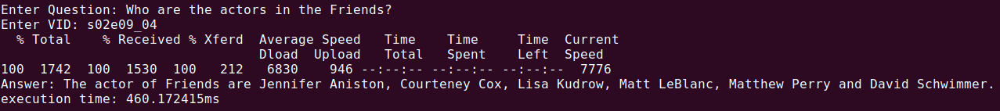

# VTT 파이프라인 통합
배포한 'VTT 모델 구현 가이드라인' 문서에 따라 각 모델을 통합 및 최적화한 코드입니다.

모델을 수행하는데 필요한 데이터 및 모델 체크포인트 등은 포함되어 있지 않습니다.

* 작성: 서울대학교 소프트웨어 플랫폼 랩

## 디렉토리 및 모델 설명
2019년 12월에 수합한 모델로 파이프라인을 구성하였습니다. 모델마다 하나의 디렉토리를 갖고 있습니다.

각 모델이 결과를 올바르게 도출하는지 여부를 확인하고자 한다면 모델 담당자에게 문의바랍니다.

아래는 각 디렉토리 이름과 디렉토리에 대한 설명입니다 (괄호 안은 수합 당시 각 모델의 container 이름입니다): 

* A: 비디오 스토리 구축 모델 (yonsei_vtt)
* B: Level Classification 모델 (level_classification)
* C: High-Level QA 모델 (snu_vqa)
* D: Knowledge-Based QA 모델 (kbqa0.3)
* E: 답안 선택 모델 (khu_answer_2)

## 코드 수합 이후 수정 내용
* 'VTT 모델 구현 가이드라인'의 R1부터 R5까지 적용
* 프로세스 기반 병렬화 (@ vtt_graph.py)
* Input Batching 적용 (@ A/extract_main.py:63)
* Model Merging 적용 (@ A/model/model.py)

## 실행 환경
* OS: Ubuntu 18.04.3 LTS
* Python: 3.6.8
* Deep Learning Framework
    * TensorFlow: 1.15.0
    * PyTorch: 1.2.0
* CUDA Toolkit: 10.0

통합 환경은 아래 docker image를 기반으로 만들었습니다:
* tensorflow/tensorflow:1.15.0-gpu-py3

## 실행 예제 
아래 명령어로 파이프라인 데모를 수행할 수 있습니다:

    $ python demo.py
  
초기화 이후, Question과 VID를 입력하면 추론한 답과 수행시간을 확인할 수 있습니다:

